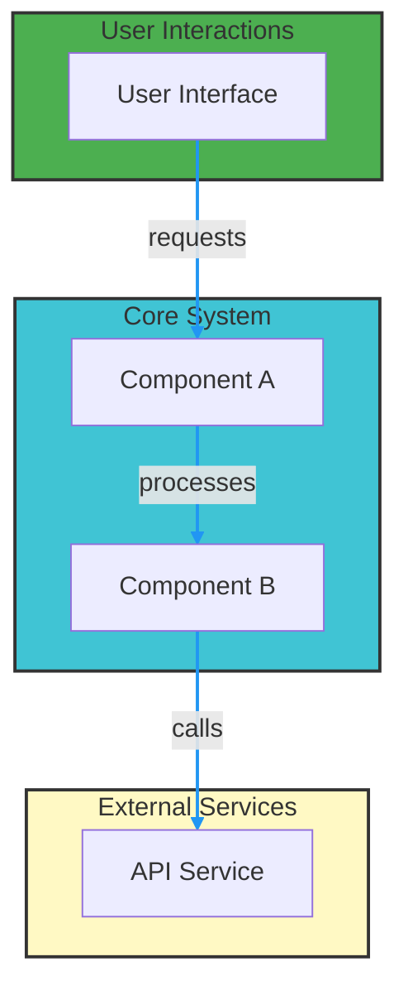

# Turner Works Mermaid Diagram Master Prompt

## Purpose

Use this prompt to resume the "Turner Works Mermaid Diagram Deployer" session. Paste it into a fresh chat (or the automation agent) to continue where we left off. It contains instructions, links, and the next actions.

## Instructions to the Agent

- **Account**: turnerworks (GitHub organization / user)
- **Task**: For every repository in turnerworks that does NOT contain a Mermaid diagram in its README (detect via ```mermaid or common mermaid keywords), generate a Turner Works branded Mermaid architecture diagram and add it to README.md (or docs/architecture.md for ambiguous repos).
- **Branching**: create branch `mermaid/add-diagram-<repo_slug>`
- **Commit message**: "docs: add system architecture Mermaid diagram"
- **PR title**: "Add Turner Works system architecture diagram"
- **PR body should include**:
  - One-line summary
  - Components extracted (bulleted)
  - How to review (preview link if available)
  - Instructions to modify colors or labels

## Branding & Templates

### Colors

| Element | Color Name | Hex Code |
|---------|------------|----------|
| Core systems | Turquoise | #40C4D4 |
| User interactions | Green | #4CAF50 |
| External services | Yellow | #FFF9C4 |
| Data flow | Blue | #2196F3 |

### Diagram Template



## Next Actions

1. List all repositories in turnerworks organization
2. For each repo, check README.md for existing Mermaid diagrams
3. If no diagram exists, analyze repo structure and generate appropriate diagram
4. Create branch, commit diagram, and open PR

## Links

- [Mermaid Live Editor](https://mermaid.live)
- [Turner Works GitHub](https://github.com/turnerworks)
- [Mermaid Documentation](https://mermaid.js.org/intro/)
